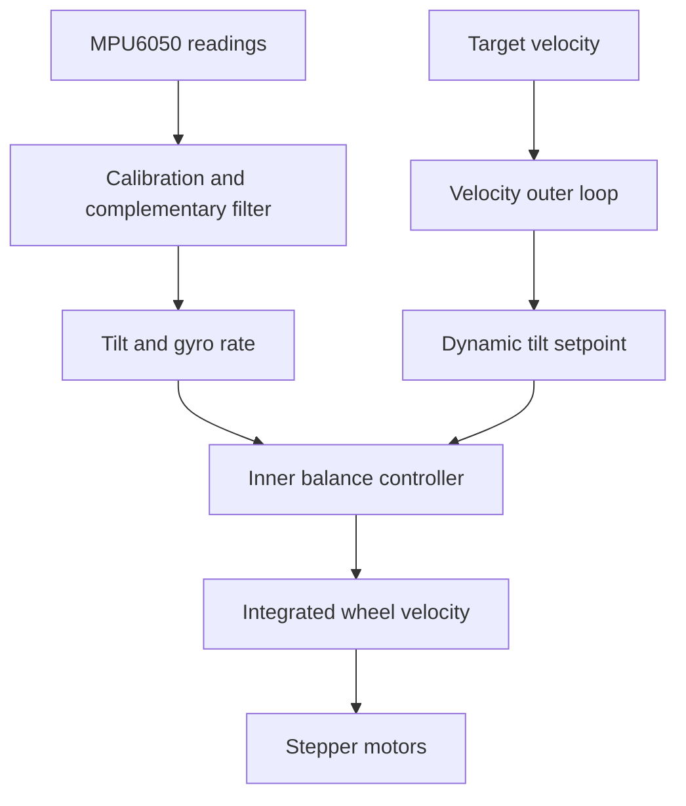

# Flip Autonomous Balance Bot

An autonomous two-wheel balancing robot developed for the Imperial College London second-year Electronics Design Project in summer 2026.

This repository documents my individual engineering contribution to **Flip**, a five-person group project. My work focused on balance control, motion-control experiments, IMU calibration, and the analogue hardware and software used to monitor the robot's batteries and power consumption.

> **Muhammad Abubakar** - control systems, remote movement, and power monitoring  
> The complete team implementation and development history are available in [Josiah Tse's Flip repository](https://github.com/FlyawayNutria/Flip).

## Project brief

The robot was required to:

- balance with its centre of gravity above the wheel axle;
- move manually in two dimensions through a remote interface;
- demonstrate autonomous behaviour using onboard sensors or imaging;
- report battery status and subsystem power consumption; and
- integrate an ESP32, Raspberry Pi, MPU6050 IMU, stepper motors, sensor electronics, and a web interface.

The original university specification and starter platform are documented in the supervisor's [Balance Robot technical guide](https://github.com/edstott/EE2Project/tree/main/balance-robot).

## My contribution

### Balance and motion control

- Co-developed the robot's static and dynamic balancing system and remote movement control.
- Developed and tuned the inner balance controller, progressing from proportional velocity control to gyro-damped PD control with acceleration-based motor commands.
- Identified stepper acceleration as an early limiting factor and increased the configured limit from **200 rad/s² to 1000 rad/s²**.
- Used the MPU6050 gyroscope rate directly for derivative damping, avoiding the delay and noise amplification of numerical differentiation.
- Added a velocity-damping term to reduce persistent low-frequency oscillation without the motor heating and current increase caused by excessive derivative gain.
- Investigated position control, wheel odometry, moving-target control, tilt-pulse movement, and state-based gain scheduling.
- Developed and tested idle, driving, and braking states to study drift, stopping behaviour, and controller transitions.

### IMU and balance-point calibration

- Compensated for stationary gyroscope bias on each axis before sensor fusion and control calculations.
- Aligned the MPU6050 pitch measurement with the robot's wheel axis using a rotation-matrix approach.
- Refined the balance setpoint to account for sensor alignment and the robot's offset centre of mass.
- Improved the final calibration by averaging the pitch estimate for **8 seconds** while the robot attempted to self-balance, reducing the effect of its approximately **2 Hz** oscillation.

### Battery and power monitoring

- Designed monitoring for battery voltage, motor-rail current, and 5 V electronics-rail current.
- Used the existing high-side shunts on the power PCB: **0.1 Ω for the motors** and **0.01 Ω for the 5 V rail**.
- Designed potential-divider, differential-amplifier, and non-inverting gain stages around an **MCP6022 rail-to-rail dual op-amp**.
- Simulated both sensing circuits in LTspice and selected gains that used most of the **0-4.096 V ADC range** without exceeding it.
- Built and tested the circuits on breadboard, selected closely matched resistors, adjusted component values from measured results, and soldered the final perfboard implementation.
- Produced software calibration equations that converted ADC voltage into shunt voltage, current, and power.

## Control architecture



The inner loop stabilised the inverted-pendulum dynamics. A velocity outer loop adjusted the target tilt to command forward and backward movement while preserving balance. The team also implemented differential steering and gyro-based closed-loop turns.

The final static-control structure was:

```text
target_acceleration = Kp * angle_error
                    + Kd * gyro_rate
                    - Kv * integrated_velocity
```

The acceleration command was integrated each control iteration to obtain the target wheel velocity. This produced smoother wheel commands than sending discontinuous velocity steps directly to the motors.

More detail is available in [Control system development](docs/control-system.md).

## Power-monitoring architecture

| Measurement | Interface | Purpose |
|---|---|---|
| Battery voltage | Potential divider | Estimate remaining battery level safely |
| Motor current | 0.1 Ω shunt + differential and gain stages | Measure motor demand during balancing and movement |
| 5 V rail current | 0.01 Ω shunt + differential and gain stages | Measure the ESP32, Raspberry Pi, and peripheral load |

The practical calibration sweeps remained highly linear:

| Circuit | Measured calibration | R² |
|---|---:|---:|
| Motor rail | `Vout = 16.936 * ΔVin + 0.2617` | 0.9994 |
| 5 V rail | `Vout = 97.936 * ΔVin + 0.0179` | 0.9981 |

More detail is available in [Power-monitoring hardware](docs/power-monitoring.md).

## Selected engineering results

- Achieved repeatable static balancing using complementary-filtered IMU feedback.
- Reduced balance oscillation while avoiding the increased motor current caused by excessive derivative gain.
- Enabled remote forward/backward motion while maintaining balance.
- Developed power-monitoring circuits whose outputs remained within the ADC range and exhibited near-linear measured responses.
- Integrated balancing, movement, steering, autonomous sensing, telemetry, and a remote web interface into one demonstrator.

## What I learned

- Controller tuning cannot compensate for every mechanical defect. Loose wheels and compliance can look like a control-software problem.
- A robot can be upright while still translating; reliable stopping requires velocity feedback as well as angle control.
- Cascaded control loops require clear bandwidth separation and dependable feedback signals.
- High-side current measurement demands careful common-mode handling, resistor matching, protection, simulation, and calibration.
- Quantitative tests made it possible to distinguish control improvements from changes that merely looked smoother.

## Project ownership

Flip was a collaborative university project completed by Muhammad Abubakar, Josiah Tse, Ihsaan Hussain, Apshara Amiruzzaman, and Usayd Hussain. This repository is a personal portfolio record of Muhammad's work; it does not claim sole ownership of the full robot or the team codebase.

For the full source tree and wider team implementation, visit the [original Flip repository](https://github.com/FlyawayNutria/Flip). Please contact the ownner for access.

